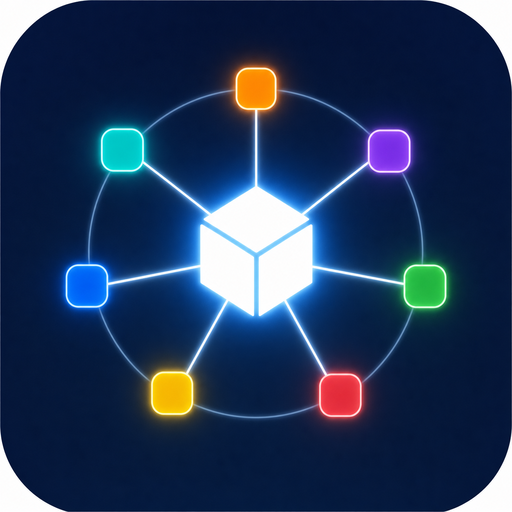

<p align="center">
  
</p>

<h1 align="center">Plattform-Interoperabilität zwischen Agent-Laufzeiten</h1>

<p align="center"><b>Eine einzige Wahrheitquelle für deine Skills, Hooks und Plugins — auf jedem KI-Coding-Agenten, den du nutzt.</b></p>

<p align="center">

[Englisch](README.md) | [Koreanisch](README.ko.md) | [Japanisch](README.ja.md) | [Vereinfachtes Chinesisch](README.zh-Hans.md) | [Spanisch](README.es.md) | [Französisch](README.fr.md) | [Deutsch](README.de.md)

</p>

---

Du betreibst nicht mehr nur einen AI-Agenten. Codex, Claude Code, Grok, Hermes, Antigravity, Cursor — jeder hat seine eigene Vorstellung davon, was ein „Skill“ ist, wo Hooks registriert werden, welche Anleitungsdatei gelesen wird, wie Sitzungen fortgesetzt werden und wie das Billing tatsächlich funktioniert. Schickt man dasselbe Tooling manuell an alle, entfernen sie sich innerhalb einer Woche voneinander. Auf die Frage „Kann ich bei Laufzeit Y überhaupt X tun?“ bekommt man die Antwort oft auf sieben verschiedenen Dokumentationsseiten — oder gar nicht dokumentiert.

Dieses Repo ist die Karte und die Methode:

1. **Ein Kompatibilitäts-Wiki, täglich aus den offiziellen Herstellerdokumenten aktualisiert.** Sieben Laufzeiten — Codex, Claude Code, Grok, Hermes, Antigravity CLI, Cursor und Kuma Studio — werden anhand von Skills, Hooks, Plugins/Erweiterungen, Projektanweisungs- und Speicherdateien, CLI-Start (interaktiv vs. headless), Sitzungswiederaufnahme und Abrechnung verglichen.
2. **Eine Methodik zum Ausrollen einer repository-eigenen einzigen Wahrheit** — Skills, Hooks, Befehle, Skripte, Referenzen, Assets, MCP/App-Verknüpfungen, Plugin-Metadaten — ohne Drift auf jede Laufzeit installiert: ein kanonischer Paket-Root, Symlink-Installationen, eindeutige Verfahren zum Stilllegen/Umbenennen und eine Validierungsliste.

## Was beantwortet wird

Fragen, für die man sonst leicht einen Nachmittag verbrät, mit Zitaten beantwortet:

| Du fragst | Die Wiki antwortet |
|---|---|
| „Kann ich einen Skill in Grok oder Hermes ausschalten?“ | Nein, es gibt für keinen von beiden einen offiziellen Schalter pro Skill — eine Umschaltung muss daher den Skill aus der Entdeckungswurzel entfernen. Genau dieser Umstand macht den Unterschied zwischen einem echten Toggle und einer Lüge. |
| „Welche Anleitungsdatei liest jeder Agent ein?“ | `AGENTS.md` vs `CLAUDE.md` vs `GEMINI.md` vs `.hermes.md` — wer was liest, in welcher Priorität und wie man eine Datei für alle gemeinsam nutzt. |
| „Wie setze ich eine Sitzung aus einem Skript fort?“ | Die Tabelle zur Sitzungswiederaufnahme: Fortsetzungsbefehl, Speicherort des Session Stores und Session-ID-Format für jede Laufzeit. |
| „Verursacht mein nächtlicher `claude -p`-Cron Kosten?“ | Mit einem Abo wird es aus dem Nutzungs-Kontingent deines Plans abgezogen — derselbe Pool wie bei interaktiver Nutzung, ohne separates Guthaben pro Ausführung (die für 2026-06-15 angekündigte separat abgerechnete Guthaben-Änderung wurde ausgesetzt und ist nicht in Kraft; `ANTHROPIC_API_KEY`-Konten bleiben Pay-as-you-go). Die Billing-Zeilen enthalten den aktuell verifizierten Status samt Datum. |
| „Gibt es auf Codex `/<skill-name>`?“ | Nein — Codex nutzt `$<skill-name>`. Die Matrix zur Skill-Aufruf-Syntax enthält jedes reale Invocations-Token jeder Laufzeit, damit du nicht mehr annimmst, dass ein Token überall gleich funktioniert. |

**Das ist die Ebene, auf der du Management-Tools aufbaust.** Kuma Studios Skill-/Hook-Umschaltsystem — das jede Skill- oder Hook-Funktion in Claude, Codex, Grok und Hermes über eine einzige GUI an- oder ausschaltet — wurde direkt auf diesen Fakten aufgebaut: Die Wiki nennt den tatsächlichen Schalter für jede Laufzeit (`skillOverrides`, `[[skills.config]]`, Hook-State-Keys), und wo es offiziell keinen Schalter gibt, sagt sie das ebenfalls, sodass das Tooling bewusst kompensiert statt zu raten. Egal, ob du ein cross-agent Dashboard, ein Sync-Tool oder einen Flottenmanager baust, dieses Wiki ist die nötige Grundlage der Wahrheit.

## Warum man es vertrauen kann

- **Jede Aussage basiert auf der Dokumentation des Anbieters.** Kein Bauchgefühl, kein Stammtisch-Wissen, kein „bei mir lief es so“.
- **Fehlende Funktionen werden erfasst, nicht ermittelt.** Wo eine Laufzeit eine Fähigkeit nicht dokumentiert, steht dort `not documented` statt einer angenommenen Gleichwertigkeit — zu wissen, dass ein Schalter *nicht existiert*, ist genauso wertvoll wie zu wissen, wo er ist.
- **Es überprüft sich selbst täglich neu.** Ein geplanter Cloud-Agent liest jede Quelle in `docs/official-sources.json` erneut ein und öffnet ein PR, wenn sich Belege geändert haben; eine deterministische Gate prüft und mergt automatisch Dokumentationsänderungen, die den Quellencheck bestehen. Veraltete Kompatibilitätstabellen lassen Cross-Runtime-Tooling verfallen — dieses hier bleibt nicht statisch.

## Was dieses Repo besitzt

- `SKILL.md` — der Skill-Entrypoint sowie die Methodik für Authoring und Interoperabilität.
- `docs/compatibility-matrix.md` — der plattformübergreifende Vergleich (Skills/Hooks/Plugins/Instruktionen, Sitzungswiederaufnahme, Skill-Aufruf).
- `docs/cli-invocation.md` — CLI-Start pro Laufzeit (interaktiv vs. headless) und Wiederaufnahmesyntax.
- `docs/plugin-packaging.md` — wie sich Plugin-/Erweiterungs-Paketierung plattformabhängig unterscheidet.
- `docs/official-sources.json` — das Quellen-Manifest, das die tägliche Aktualisierung erneut verifiziert.
- `docs/cloud-automation.md` — die tägliche Aktualisierungsautomatisierung und warum sie in der Cloud läuft.
- `docs/completion-stack.md` — native Abschluss-/Verifikations-Stacks (Claude Code `/goal`·Stop-Hook·`/verify`; Codex Goals·Stop-Hook·`/review`) samt verifizierter Korrekturen.
- `docs/kuma-studio-patterns.md` — öffentliche Betriebs-Patterns von Kuma Studio.
- `CHANGELOG.md` plus das Git-Tag — die Versionshistorie. Die Historie bleibt hier und nicht in den Dokumenten selbst.

## Tägliche Wiki-Aktualisierung

Ein täglicher Agent hält das Wiki aktuell: Er liest `docs/official-sources.json`, ruft die offiziellen Anbieter-URLs ab und öffnet eine Pull Request, wenn sich die Belege ändern. Auf `main` wird nicht direkt gepusht.

Der empfohlene Weg ist **Claude Routines** — eine geplante Claude Code-Sitzung, die in Anthropic Cloud auf einem Claude-Abo läuft, ohne API-Key und ohne GitHub Actions, und die auch läuft, wenn dein Laptop zugeklappt ist. Die Ausführung **lokal** über `claude -p` wird vor allem aus **Zuverlässigkeitsgründen** abgeraten: Ein lokaler Cron läuft nur, solange der Rechner aktiv ist, während eine Cloud-Routine unabhängig vom Laptop-Zustand läuft. (Zum Billing: Mit einem Abo entnehmen `claude -p` und die Agent-SDK-Nutzung den Nutzungs-Pool deines Abos — die für den 2026-06-15 angekündigte getrennte monatliche Gutschriften-Änderung wurde ausgesetzt und ist nicht in Kraft; bei `ANTHROPIC_API_KEY` gilt weiterhin Pay-as-you-go. `docs/cli-invocation.md` enthält den aktuell verifizierten Status samt Datum.) Siehe `docs/cloud-automation.md`.

1. Starte in Claude Code `/schedule` (oder öffne <https://claude.ai/code/routines>).
2. Richte die Routine auf dieses Repository und nutze den Prompt in `prompts/daily-official-doc-update.md`.
3. Plane sie auf einmal täglich. Sie öffnet ein PR und führt dann ein Auto-Merge-Gate aus, das Docs-only-Änderungen, die den Quellcheck bestehen, squash-merged; alles andere wartet auf deine Freigabe (siehe `docs/cloud-automation.md`).

Codex-Nutzer können denselben Ablauf mit einer Codex App Automation ausführen. Siehe `docs/cloud-automation.md` für beide Wege.

## Lokale Checks

```bash
node scripts/check-official-sources.mjs --write-report
```

Das Skript validiert Quell-IDs, erlaubte offizielle Hosts, URL-Erreichbarkeit, die erforderlichen Quellkategorien und das `SKILL.md`-Zeilenbudget.